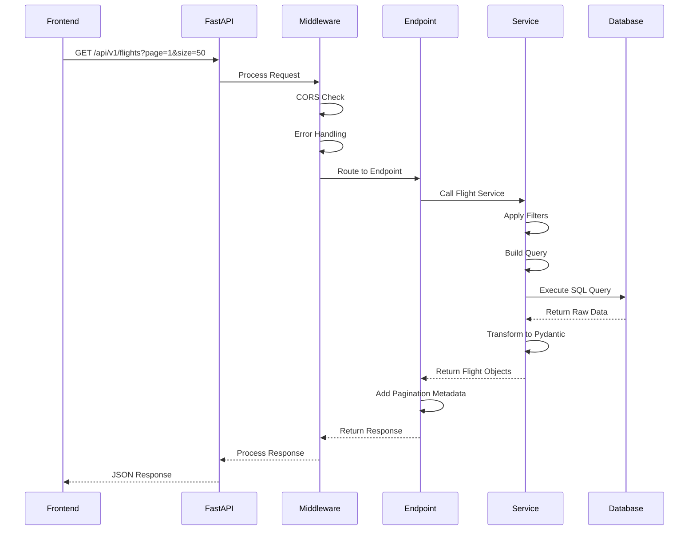
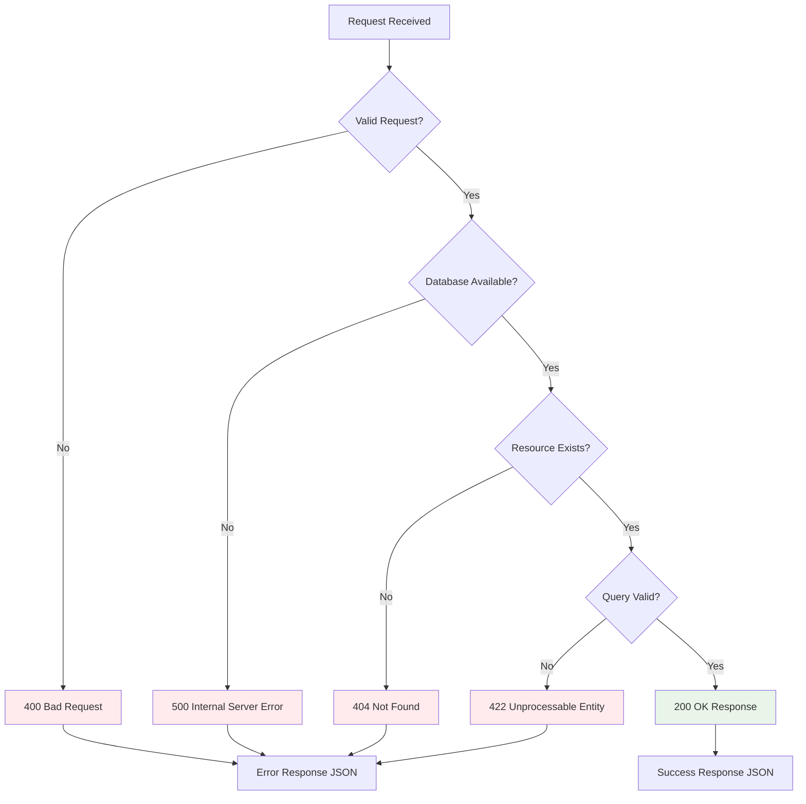
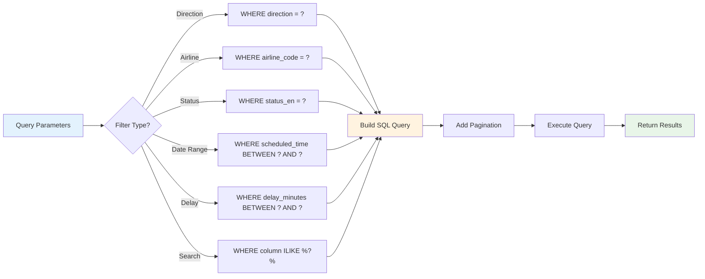
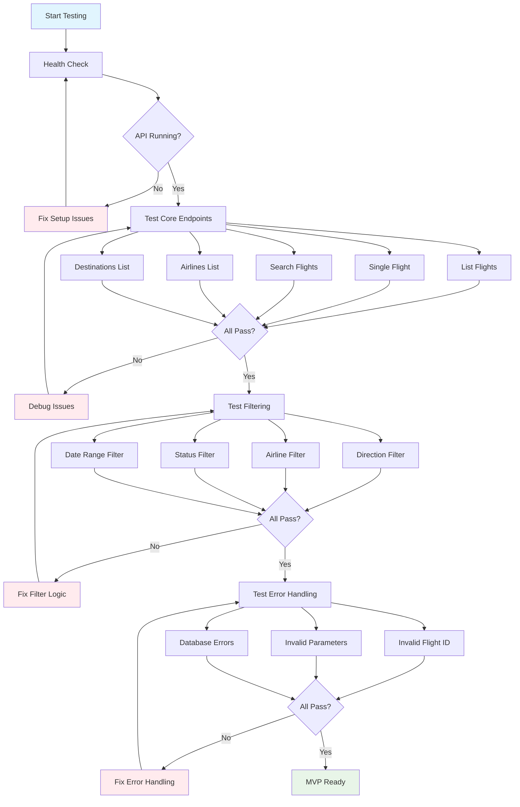
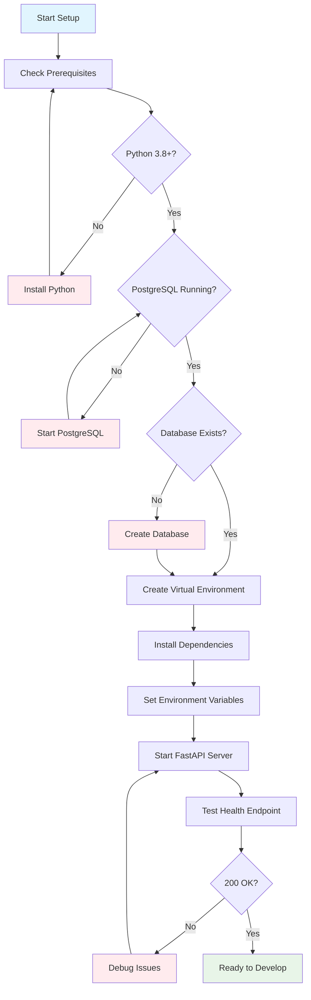
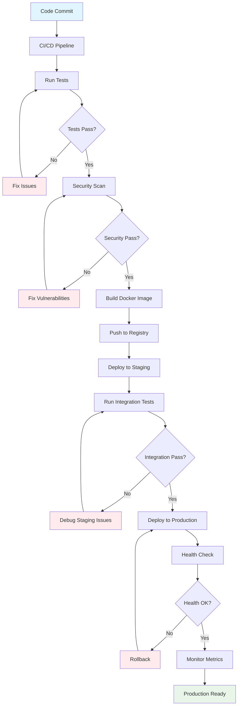
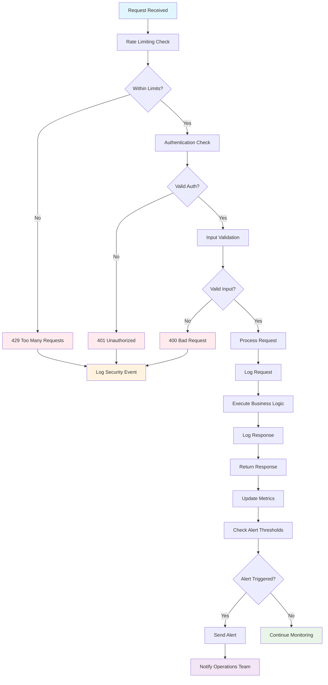
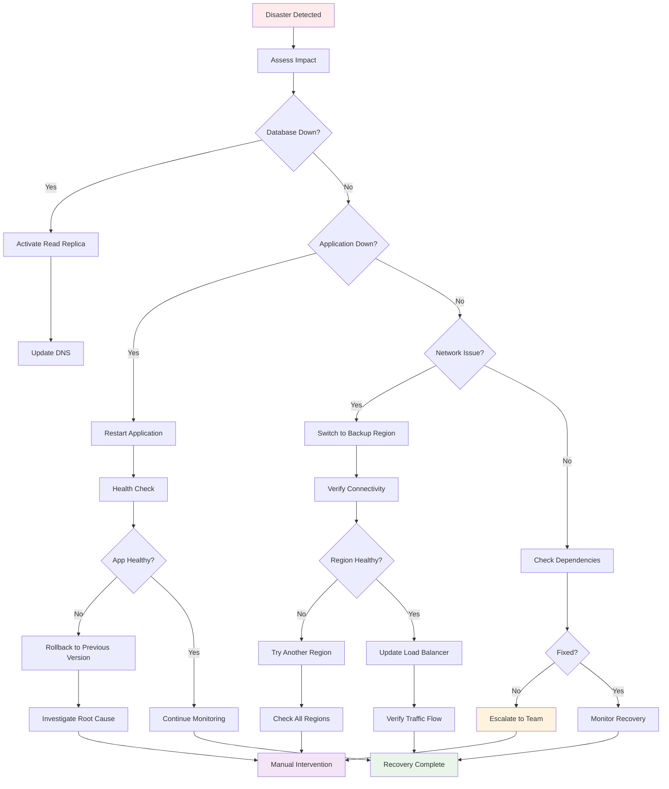

# FastAPI Backend Flow Diagram

## Data Flow Architecture

```mermaid
graph TB
    subgraph "Frontend Layer"
        A[React Dashboard] --> B[HTTP Requests]
    end
    
    subgraph "API Gateway Layer"
        B --> C[FastAPI Application]
        C --> D[CORS Middleware]
        D --> E[Authentication Middleware]
        E --> F[Error Handling Middleware]
    end
    
    subgraph "API Endpoints Layer"
        F --> G[GET /api/v1/flights]
        F --> H[GET /api/v1/flights/{id}]
        F --> I[GET /api/v1/flights/search]
        F --> J[GET /api/v1/flights/stats]
        F --> K[GET /api/v1/airlines]
        F --> L[GET /api/v1/destinations]
    end
    
    subgraph "Business Logic Layer"
        G --> M[Flight Service]
        H --> M
        I --> M
        J --> M
        K --> M
        L --> M
        M --> N[Filtering & Pagination]
        M --> O[Search Logic]
        M --> P[Statistics Calculation]
    end
    
    subgraph "Data Access Layer"
        N --> Q[SQLAlchemy ORM]
        O --> Q
        P --> Q
        Q --> R[Database Session]
        R --> S[Query Builder]
    end
    
    subgraph "Database Layer"
        S --> T[(PostgreSQL)]
        T --> U[flights table]
        U --> V[~9,909 records]
    end
    
    subgraph "Response Flow"
        V --> W[Raw Data]
        W --> X[Pydantic Models]
        X --> Y[JSON Serialization]
        Y --> Z[HTTP Response]
        Z --> A
    end
    
    style A fill:#e1f5fe
    style T fill:#f3e5f5
    style C fill:#e8f5e8
    style M fill:#fff3e0
```

## Request Processing Flow



## Error Handling Flow



## Filtering & Search Flow



## MVP Testing Flow



## Environment Setup Flow



## Production Deployment Flow



## Security & Monitoring Flow



## Disaster Recovery Flow


