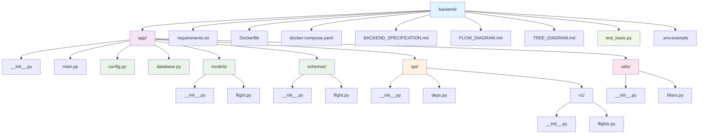
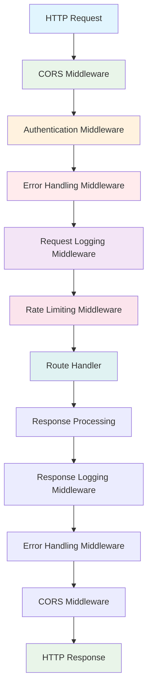

# FastAPI Backend Tree Diagram

## Project Structure Tree



## API Endpoints Tree

```mermaid
graph TD
    A[FastAPI Application] --> B[/api/v1/]
    A --> C[/health/]
    
    B --> D[flights/]
    B --> E[airlines/]
    B --> F[destinations/]
    
    C --> G[GET /health]
    C --> H[GET /ready]
    C --> I[GET /metrics]
    
    D --> J[GET /flights]
    D --> K[GET /flights/{flight_id}]
    D --> L[GET /flights/search]
    D --> M[GET /flights/stats]
    
    J --> N[Query Parameters]
    N --> O[page: int]
    N --> P[size: int]
    N --> Q[direction: str]
    N --> R[airline_code: str]
    N --> S[status: str]
    N --> T[terminal: str]
    N --> U[date_from: str]
    N --> V[date_to: str]
    N --> W[delay_min: int]
    N --> X[delay_max: int]
    
    E --> Y[GET /airlines]
    Y --> Z[search: str]
    
    F --> AA[GET /destinations]
    AA --> BB[search: str]
    AA --> CC[country: str]
    
    style A fill:#e1f5fe
    style B fill:#f3e5f5
    style C fill:#e8f5e8
    style D fill:#e8f5e8
    style E fill:#fff3e0
    style F fill:#fff3e0
```

## Database Schema Tree

```mermaid
graph TD
    A[flights table] --> B[Primary Key]
    A --> C[Flight Info]
    A --> D[Timing Info]
    A --> E[Location Info]
    A --> F[Airline Info]
    A --> G[Terminal Info]
    A --> H[Status Info]
    A --> I[Metadata]
    
    B --> J[flight_id: VARCHAR(32)]
    
    C --> K[airline_code: VARCHAR(10)]
    C --> L[flight_number: VARCHAR(20)]
    C --> M[direction: VARCHAR(1)]
    C --> N[location_iata: VARCHAR(10)]
    
    D --> O[scheduled_time: TIMESTAMP]
    D --> P[actual_time: TIMESTAMP]
    D --> Q[delay_minutes: INTEGER]
    
    E --> R[location_en: VARCHAR(100)]
    E --> S[location_he: VARCHAR(100)]
    E --> T[location_city_en: VARCHAR(100)]
    E --> U[country_en: VARCHAR(100)]
    E --> V[country_he: VARCHAR(100)]
    
    F --> W[airline_name: VARCHAR(100)]
    
    G --> X[terminal: VARCHAR(10)]
    G --> Y[checkin_counters: VARCHAR(100)]
    G --> Z[checkin_zone: VARCHAR(100)]
    
    H --> AA[status_en: VARCHAR(100)]
    H --> BB[status_he: VARCHAR(100)]
    
    I --> CC[scrape_timestamp: TIMESTAMP]
    I --> DD[raw_s3_path: VARCHAR(500)]
    
    style A fill:#e1f5fe
    style B fill:#ffebee
    style C fill:#e8f5e8
    style D fill:#fff3e0
    style E fill:#f3e5f5
    style F fill:#e0f2f1
    style G fill:#fce4ec
    style H fill:#f1f8e9
    style I fill:#e8eaf6
```

## Response Schema Tree

```mermaid
graph TD
    A[API Response] --> B[Success Response]
    A --> C[Error Response]
    
    B --> D[Single Flight]
    B --> E[Flight List]
    B --> F[Statistics]
    B --> G[Airline List]
    B --> H[Destination List]
    
    D --> I[Flight Object]
    I --> J[flight_id: string]
    I --> K[airline_code: string]
    I --> L[flight_number: string]
    I --> M[direction: string]
    I --> N[location_iata: string]
    I --> O[scheduled_time: string]
    I --> P[actual_time: string]
    I --> Q[airline_name: string]
    I --> R[location_en: string]
    I --> S[location_he: string]
    I --> T[location_city_en: string]
    I --> U[country_en: string]
    I --> V[country_he: string]
    I --> W[terminal: string]
    I --> X[checkin_counters: string]
    I --> Y[checkin_zone: string]
    I --> Z[status_en: string]
    I --> AA[status_he: string]
    I --> BB[delay_minutes: integer]
    I --> CC[scrape_timestamp: string]
    I --> DD[raw_s3_path: string]
    
    E --> EE[data: Flight[]]
    E --> FF[pagination: object]
    FF --> GG[page: integer]
    FF --> HH[size: integer]
    FF --> II[total: integer]
    FF --> JJ[pages: integer]
    FF --> KK[has_next: boolean]
    FF --> LL[has_prev: boolean]
    
    C --> MM[error: object]
    MM --> NN[code: string]
    MM --> OO[message: string]
    MM --> PP[details: object]
    
    style A fill:#e1f5fe
    style B fill:#e8f5e8
    style C fill:#ffebee
    style I fill:#fff3e0
    style FF fill:#f3e5f5
    style MM fill:#fce4ec
```

## Middleware Stack Tree



## Service Layer Tree

```mermaid
graph TD
    A[API Endpoints] --> B[Flight Service]
    A --> C[Airline Service]
    A --> D[Destination Service]
    A --> E[Statistics Service]
    
    B --> F[get_flights()]
    B --> G[get_flight_by_id()]
    B --> H[search_flights()]
    B --> I[get_flight_stats()]
    
    F --> J[Filtering Logic]
    F --> K[Pagination Logic]
    F --> L[Sorting Logic]
    
    G --> M[ID Validation]
    G --> N[Database Lookup]
    
    H --> O[Search Query Builder]
    H --> P[Multi-field Search]
    
    I --> Q[Aggregation Logic]
    I --> R[Grouping Logic]
    
    J --> S[Database Query]
    K --> S
    L --> S
    N --> S
    O --> S
    P --> S
    Q --> S
    R --> S
    
    S --> T[SQLAlchemy ORM]
    T --> U[PostgreSQL Database]
    
    style A fill:#e1f5fe
    style B fill:#e8f5e8
    style C fill:#fff3e0
    style D fill:#f3e5f5
    style E fill:#fce4ec
    style S fill:#e0f2f1
    style U fill:#ffebee
```

## Testing Structure Tree

```mermaid
graph TD
    A[Testing Strategy] --> B[Manual Testing]
    A --> C[Automated Testing]
    
    B --> D[Core Functionality]
    B --> E[Filtering Tests]
    B --> F[Error Handling]
    B --> G[Performance Tests]
    
    D --> H[Health Check]
    D --> I[List Flights]
    D --> J[Single Flight]
    D --> K[Search Flights]
    D --> L[Airlines List]
    D --> M[Destinations List]
    
    E --> N[Direction Filter]
    E --> O[Airline Filter]
    E --> P[Status Filter]
    E --> Q[Date Range Filter]
    E --> R[Delay Filter]
    
    F --> S[Invalid Flight ID]
    F --> T[Invalid Parameters]
    F --> U[Database Errors]
    F --> V[CORS Issues]
    
    C --> W[test_basic.py]
    W --> X[test_health_check()]
    W --> Y[test_list_flights()]
    W --> Z[test_single_flight()]
    W --> AA[test_search()]
    W --> BB[test_filtering()]
    
    style A fill:#e1f5fe
    style B fill:#e8f5e8
    style C fill:#fff3e0
    style W fill:#f3e5f5
```

## Environment Setup Tree

```mermaid
graph TD
    A[Environment Setup] --> B[Prerequisites]
    A --> C[Quick Start]
    A --> D[Docker Setup]
    A --> E[Production Setup]
    
    B --> F[Python 3.8+]
    B --> G[PostgreSQL Running]
    B --> H[Database Created]
    B --> I[Flights Table Populated]
    
    C --> J[Create Virtual Environment]
    C --> K[Install Dependencies]
    C --> L[Set Environment Variables]
    C --> M[Start FastAPI Server]
    C --> N[Test Health Endpoint]
    
    D --> O[Docker Compose]
    D --> P[Environment File]
    D --> Q[Port Configuration]
    D --> R[Volume Mounts]
    
    E --> S[Kubernetes Cluster]
    E --> T[Load Balancer]
    E --> U[Managed Database]
    E --> V[Secret Management]
    E --> W[Monitoring Stack]
    
    J --> X[python -m venv venv]
    K --> Y[pip install -r requirements.txt]
    L --> Z[export DATABASE_URL=...]
    M --> AA[python -m app.main]
    N --> BB[curl http://localhost:8000/health]
    
    S --> CC[Helm Charts]
    T --> DD[Ingress Controller]
    U --> EE[Connection Pooling]
    V --> FF[AWS Secrets Manager]
    W --> GG[Prometheus + Grafana]
    
    style A fill:#e1f5fe
    style B fill:#e8f5e8
    style C fill:#fff3e0
    style D fill:#f3e5f5
    style E fill:#ffebee
```



## Production Infrastructure Tree

```mermaid
graph TD
    A[Production Infrastructure] --> B[Application Layer]
    A --> C[Database Layer]
    A --> D[Monitoring Layer]
    A --> E[Security Layer]
    A --> F[Networking Layer]
    
    B --> G[FastAPI Application]
    B --> H[Load Balancer]
    B --> I[Auto Scaling Group]
    B --> J[Container Registry]
    
    C --> K[Primary Database]
    C --> L[Read Replicas]
    C --> M[Backup Database]
    C --> N[Redis Cache]
    
    D --> O[Prometheus]
    D --> P[Grafana]
    D --> Q[ELK Stack]
    D --> R[Sentry]
    D --> S[AlertManager]
    
    E --> T[WAF]
    E --> U[API Gateway]
    E --> V[Secrets Manager]
    E --> W[Certificate Manager]
    E --> X[Security Groups]
    
    F --> Y[VPC]
    F --> Z[Subnets]
    F --> AA[Route Tables]
    F --> BB[NAT Gateway]
    F --> CC[Internet Gateway]
    
    G --> DD[Health Checks]
    G --> EE[Graceful Shutdown]
    G --> FF[Resource Limits]
    
    K --> GG[Point-in-time Recovery]
    K --> HH[Encryption at Rest]
    K --> II[Connection Pooling]
    
    O --> JJ[Custom Metrics]
    O --> KK[Business Metrics]
    O --> LL[Infrastructure Metrics]
    
    T --> MM[Rate Limiting]
    T --> NN[DDoS Protection]
    T --> OO[Bot Protection]
    
    style A fill:#e1f5fe
    style B fill:#e8f5e8
    style C fill:#fff3e0
    style D fill:#f3e5f5
    style E fill:#ffebee
    style F fill:#e0f2f1
```



## Security Architecture Tree

```mermaid
graph TD
    A[Security Architecture] --> B[Authentication]
    A --> C[Authorization]
    A --> D[Data Protection]
    A --> E[Network Security]
    A --> F[Monitoring & Auditing]
    
    B --> G[API Keys]
    B --> H[JWT Tokens]
    B --> I[OAuth 2.0]
    B --> J[Multi-Factor Auth]
    
    C --> K[Role-Based Access]
    C --> L[Resource Permissions]
    C --> M[API Endpoint Access]
    C --> N[Data Access Control]
    
    D --> O[Encryption in Transit]
    D --> P[Encryption at Rest]
    D --> Q[Data Masking]
    D --> R[PII Protection]
    D --> S[Secure Key Storage]
    
    E --> T[HTTPS Only]
    E --> U[CORS Configuration]
    E --> V[Security Headers]
    E --> W[IP Whitelisting]
    E --> X[VPN Access]
    
    F --> Y[Access Logging]
    F --> Z[Audit Trails]
    F --> AA[Security Monitoring]
    F --> BB[Incident Response]
    F --> CC[Compliance Reporting]
    
    G --> DD[Key Rotation]
    H --> EE[Token Expiration]
    I --> FF[Scope Management]
    
    O --> GG[TLS 1.3]
    P --> HH[AES-256]
    Q --> II[Data Anonymization]
    
    T --> JJ[HSTS Headers]
    U --> KK[Origin Validation]
    V --> LL[OWASP Headers]
    
    Y --> MM[Request Tracking]
    Z --> NN[Change Logging]
    AA --> OO[Threat Detection]
    
    style A fill:#e1f5fe
    style B fill:#e8f5e8
    style C fill:#fff3e0
    style D fill:#f3e5f5
    style E fill:#ffebee
    style F fill:#e0f2f1
```



## Monitoring & Observability Tree

```mermaid
graph TD
    A[Monitoring & Observability] --> B[Application Metrics]
    A --> C[Infrastructure Metrics]
    A --> D[Business Metrics]
    A --> E[Logging]
    A --> F[Alerting]
    A --> G[Tracing]
    
    B --> H[Request Rate]
    B --> I[Response Time]
    B --> J[Error Rate]
    B --> K[Throughput]
    B --> L[Latency Percentiles]
    
    C --> M[CPU Usage]
    C --> N[Memory Usage]
    C --> O[Disk Usage]
    C --> P[Network I/O]
    C --> Q[Database Connections]
    
    D --> R[Flight Searches]
    D --> S[Popular Routes]
    D --> T[User Activity]
    D --> U[API Usage]
    D --> V[Data Freshness]
    
    E --> W[Application Logs]
    E --> X[Access Logs]
    E --> Y[Error Logs]
    E --> Z[Audit Logs]
    E --> AA[Security Logs]
    
    F --> BB[Error Rate Alerts]
    F --> CC[Performance Alerts]
    F --> DD[Resource Alerts]
    F --> EE[Business Alerts]
    F --> FF[Security Alerts]
    
    G --> GG[Request Tracing]
    G --> HH[Database Queries]
    G --> II[External Calls]
    G --> JJ[Performance Bottlenecks]
    
    H --> KK[Prometheus Counter]
    I --> LL[Prometheus Histogram]
    J --> MM[Prometheus Counter]
    
    W --> NN[Structured JSON]
    X --> OO[Common Log Format]
    Y --> PP[Error Stack Traces]
    
    BB --> QQ[PagerDuty]
    CC --> RR[Slack Notifications]
    DD --> SS[Email Alerts]
    
    style A fill:#e1f5fe
    style B fill:#e8f5e8
    style C fill:#fff3e0
    style D fill:#f3e5f5
    style E fill:#ffebee
    style F fill:#e0f2f1
    style G fill:#f1f8e9
```


