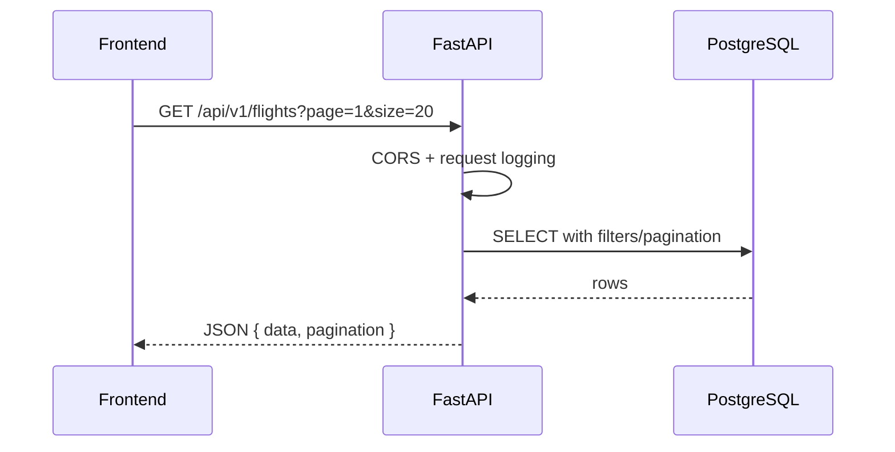
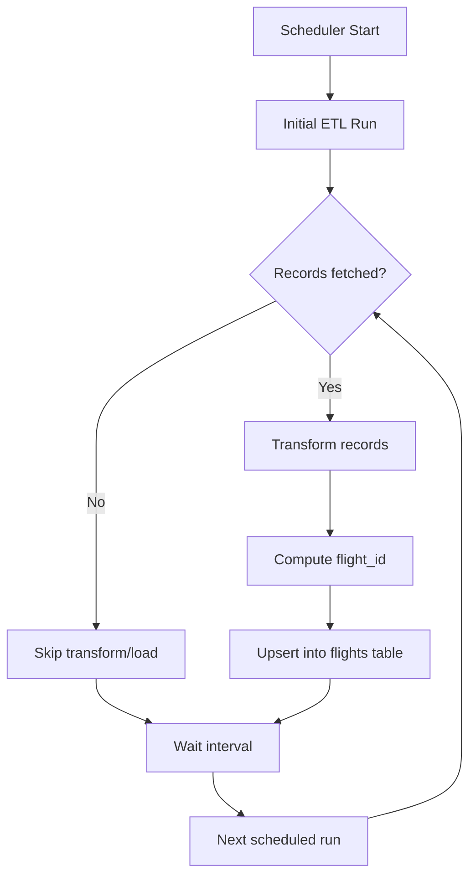
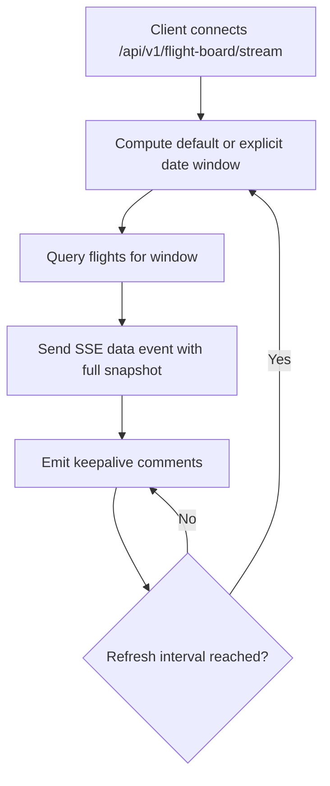
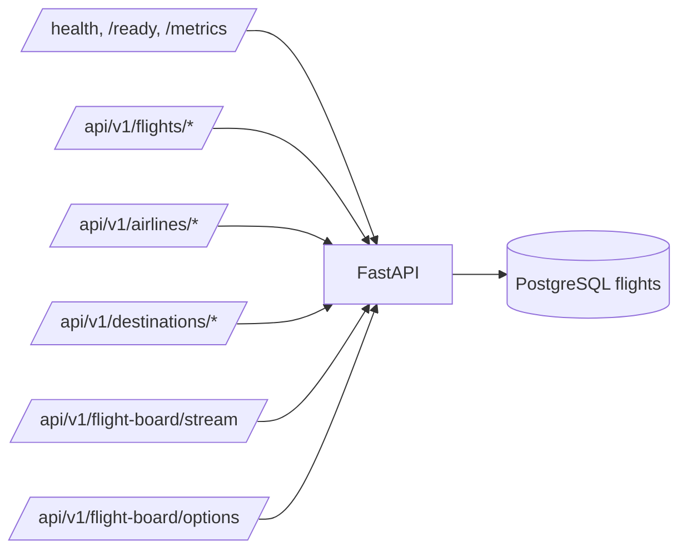

# Backend Flow Diagrams (Current)

## Request Flow

## ETL Runtime Flow

## Flight Board SSE Flow

## API Surface Map

## Notes
- Authentication middleware is not part of the current request pipeline.
- Airflow diagrams from older versions are intentionally excluded from this current-state document.
